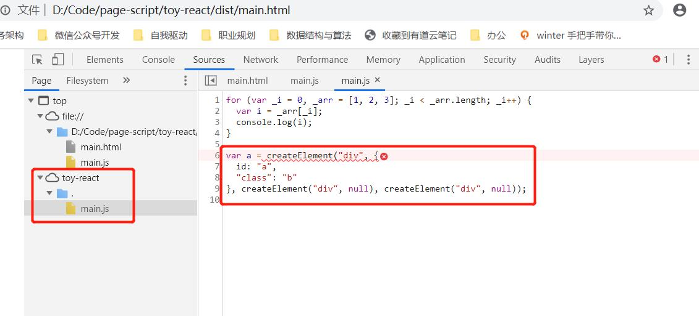

## before
```
node -v
npm -v
```

## webpack init

```
npm install webpack webpack-cli --save-dev
```

**webpack说明** 
> 主要：将js中一堆required和import的文件打包为单一JS  
> 同时：承载很多非常有用的工具

### 工具Babel
- 将新版本的JS翻译成旧版本的JS
- 通过loader的方式
- 例如：可以通过css-loader将css打包为js

### webpack.config.js
- entry
- 打包后js可读
```
module.exports={
    entry:{
        main: './main.js'
    },
    mode:"development",
    optimization:{
        minimize : false
    }
}
```


## project config

打包
```
npx webpack
```

安装适配JS版本工具Babel
```
npm install --save-dev babel-loader  @babel/core @babel/preset-env
```

## run
```
npm run build
```

安装能够支持JSX的插件

```
npm install @babel/plugin-transform-react-jsx --save-dev
```
> 它是Babel的插件，安装完成后要改下Babel的option  

  

---
  ### 以上是环境安装部分  
---
通过这样一段测试代码，看看是如何翻译JSX的
```
let a=<div id='b' class='c'>
<div></div>
<div></div>
<div></div>
</div>
```
在编译目录dist下新建main.html并引入main.js
```
<script src="main.js"></script>
```
打包后，双击用浏览器打开，F12查看编译后结果

可以得出创建Element的语法可以总结为
```
// attributes 为 Object, children 为变长参数
function createElement(tagName, attributes, ...children){
    let e = createElement(tagName);
    for (let p in attributes) {
        e.setAttribute(p, attributes);
    }
    for (let child of children) {
        e.appendChild(child);
    }
    return e;
}
```

---

### 自定义tag
- 由于不能在原生的Dom中新增自定义元素，因此，可以在所有原生dom外面新增一层wrapper，都返回自定义class。


1. 分层 -> 建立toy-react.js，export 提取刚才的create。自定义包装也放这

2. 定义ElementWrapper 和 TextWrapper

3. div替换为MyComponet,使用render代替append

4. export 组件，替换原生document写法

5. 调试组件
